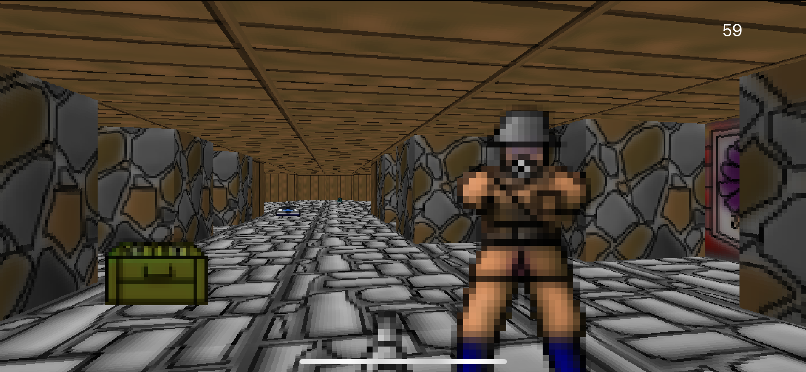

# Mein Leben!

Swiftenstein is a partial reimplementation of ID Software's 1992 classic FPS [Wolfenstein 3D](https://en.wikipedia.org/wiki/Wolfenstein_3D) in Swift for iOS. It is not a complete game, just a single-level tech demo.

It's also not a completely faithful recreation of the original game engine - I've deliberately removed some features and added others that weren't in the original, but it should be close enough for nostalgia purposes.

For copyright reasons, I've redrawn (badly) the Wolfenstein wall textures and sprites, but if you would prefer to use [Adrian Carmack](https://en.wikipedia.org/wiki/Adrian_Carmack)'s original graphics, a web search for ["Wolfenstein sprites"](https://duckduckgo.com/?q=wolfenstein+sprites&t=osx&iar=images&iax=images&ia=images) should provide a good starting point.

This code is not particularly polished or well-structured. I wrote it as a learning exercise and am releasing it for educational purposes. I may improve it in future, or I may not. If you feel like improving it yourself, please open a PR.

## How to Play

The game can be played one-handed in either portrait or landscape orientation. The entire screen acts as a virtual thumbstick for turning left/right and moving forwards/backwards (there's no strafing support as yet). Tap anywhere to fire.

If you have a phone with 3D Touch support you can force-touch to autofire. Otherwise you'll need to tap repeatedly.

Enemies are placed randomly, so if you're unlucky you may be shot in the back immediately when the game starts. You have limited health and ammo, but if you turn right at the start you'll see a submachine gun that should help your chances of survival.

There are a couple of secret sliding pushwalls - see if you can find them. Be careful not to accidentally crush yourself to death!

Find the elevator switch to complete the level. Once you flip the switch, the level will reset.

## How it Works

In 1992 there were no 3D graphics cards, and no standard 3D graphics APIs like OpenGL or DirectX. Wolfenstein's engine had to draw every pixel to the screen manually using a technique called *ray casting*.

Swiftenstein replicates this technique. All drawing is done by manipulating an array of ARGB pixel values, which is then finally turned into a `UIImage` and displayed in a `UIImageView`.

On a modern system, this is *absolutely not* the right way to implement 3D graphics. From a performance and battery-life point of view, this is a terrible way to put pixels on the screen, and you should instead take advantage of dedicated 3D rendering hardware in the GPU (using SceneKit or Metal).

But ray casting is a pretty cool technique to learn all the same, with applications beyond graphics rendering. For example, Swiftenstein re-uses the same ray casting logic for bullet hit detection, hidden object culling and line-of-sight tests between enemies and player, and this would still be applicable even if the game used a modern GPU-based renderer.

If you want to learn more about ray casting, I recommend Fabian Sanglard's excellent [Wolfenstein 3D Game Engine Black Book](https://www.amazon.co.uk/gp/product/1727646703/ref=as_li_tl?ie=UTF8&camp=1634&creative=6738&creativeASIN=1727646703&linkCode=as2&tag=charcoaldesig-21&linkId=aab5d43499c96f7417b7aa0a7b3e587d) and also Lode Vandevenne's amazing [Raycasting tutorial series](https://lodev.org/cgtutor/raycasting.html).
